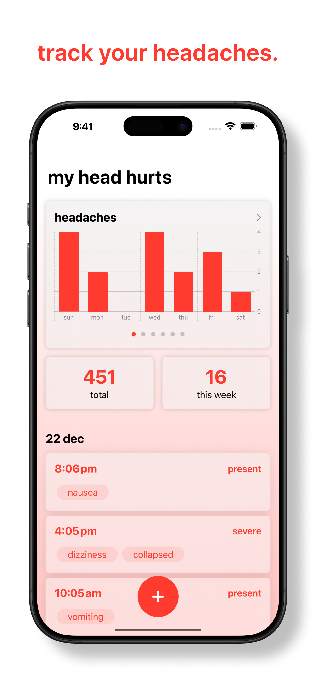
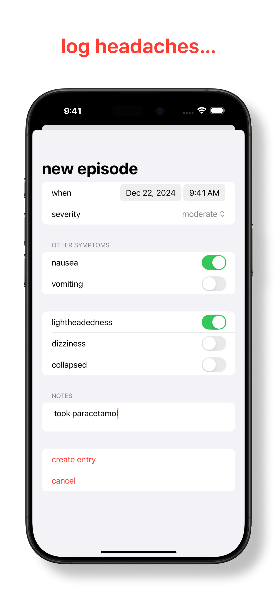
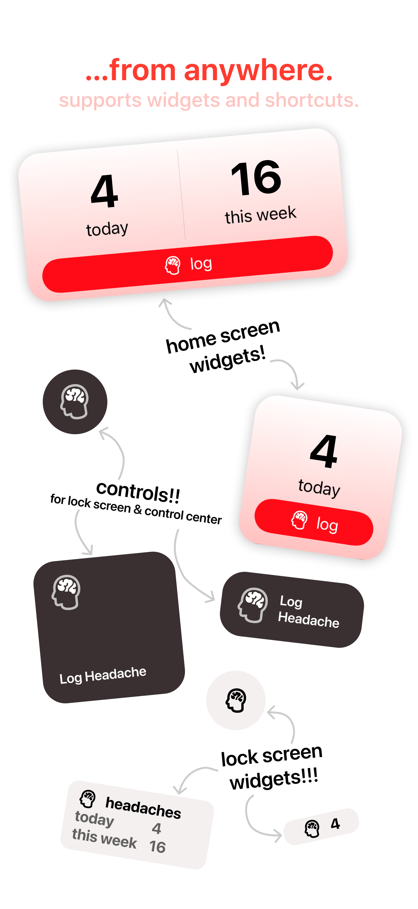
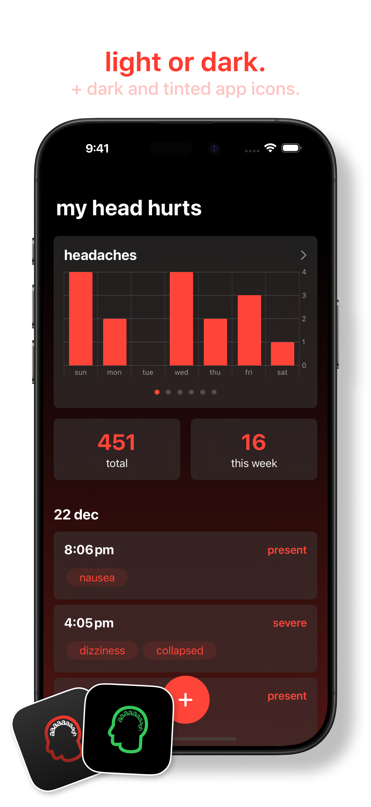
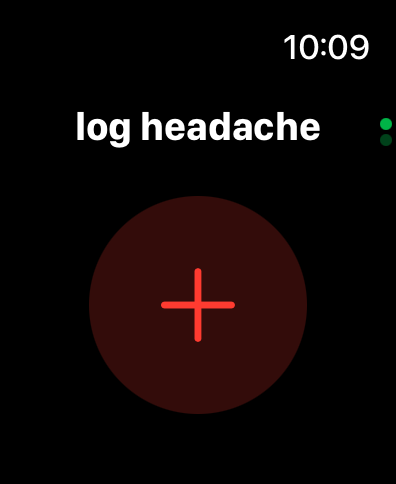
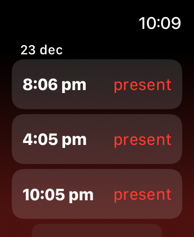
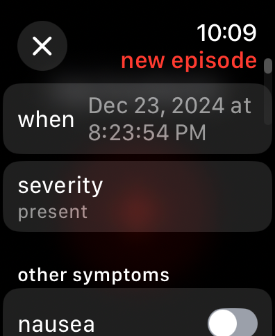

# my head hurts
my neurologist told me to create a headache journal, not sure if this is what she meant. figured someone else might find it useful so i published it.

## screenshots
### iOS
|   |   |   |   |
|---|---|---|---|
|  |  |  |  |

### watchOS
|   |   |   |
|---|---|---|
|  |  |  |

## features
### log symptoms
- log headache severity, as well as symptoms like nausea, vomiting, lightheadedness, dizziness, and whether or not you collapsed
- integrates with HealthKit: your symptoms also shows up in your Health app

### log from anywhere
- supports Siri Shortcuts: you can set my head hurts as an Action Button action to quickly log a headache
- supports Lock Screen, Home Screen, and Control Center widgets so you can easily log a headache

### spot trends
- see weekly graphs to see how your symptoms change throughout the week
- view a heat map based on the number of episodes reported per day

### private
- syncs with iCloud: your data is synced across all your devices with iCloud
- we don't have access to any of your data

### open source
- license: [MIT license](LICENSE)
- feel free to submit [issues](https://github.com/jiachenyee/myheadhurts/issues) if you find any bugs, issues, or have any feature requests
